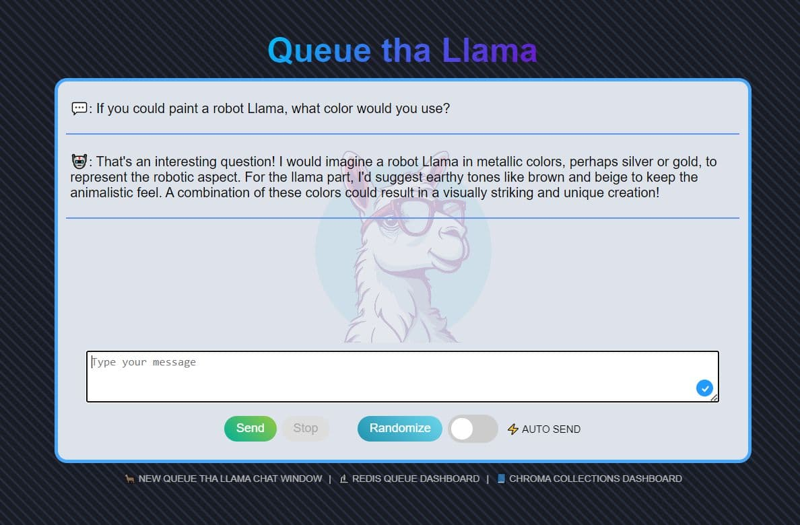

# 🦙 Queue tha Llama
This is a web-based chat application that integrates Large Language Model (LLM) capabilities with Bull Queue, Redis, and Chroma. It handles concurrent chat sessions with advanced queue management, maintains robust client-server communication with heartbeat signals, utilizes a RAG model for chat memory, and smartly manages inactive clients and job cleanups for a seamless chat experience.



---

## Prerequisites

- ### Install npm Dependencies
    run from cloned repo directory
    ```
    npm ci
    ```

- ### Setup [Redis](https://redis.io/) Docker Container  
    pull docker image
    ```
    docker pull redis
    ```
  
    run redis in docker
    ```
    docker run -p 6379:6379 --name llm-redis -d redis
    ```

- ### Setup [Chroma](https://www.trychroma.com/) Vector Store Container
  Pull latest Docker Image
  ```
  docker pull chromadb/chroma
  ```

  Create storage for your Chroma Docker instance:
  - create a directory somewhere on the server  
    (example: `c:\chromadb-storage\`)

  Start a Docker Container using server storage from previous step  
  ```
  docker run -d --name llm-chroma -p 8001:8000 -v C:\Git\llama\chromadb-storage:/chroma/chroma chromadb/chroma
  ```

- ### Download Embedding Models
  - ##### all-MiniLM-L6-v2
    - download all files from https://huggingface.co/Xenova/all-MiniLM-L6-v2/tree/main and save them to the `models/all-Min0LM-L6-v2` folder

  - ##### paraphrase-multilingual-MiniLM-L12-v2 (optional)
    - download all files from https://huggingface.co/Xenova/paraphrase-multilingual-MiniLM-L12-v2/tree/main and save them to the `models/paraphrase-multilingual-MiniLM-L12-v2` folder

- ### Download and Run an LLM via Llama.cpp  
  - Download the lastest version of `llama.cpp` from https://github.com/ggerganov/llama.cpp or run the downloader PowerShell Script here:  
    `./tools/download-latest-llama.ps1`
  - Download a model (GGUF architecture) and save to your computer (note the path as it will be required when runing your LLM Server)  
    ⇢ Reccomended 7B models to try:
      - [NeuralBeagle14-7B-GGUF](https://huggingface.co/TheBloke/NeuralBeagle14-7B-GGUF/blob/main/neuralbeagle14-7b.Q4_K_M.gguf)
      - [Mistral-7B-Instruct-v0.2-GGUF](https://huggingface.co/TheBloke/Mistral-7B-Instruct-v0.2-GGUF/blob/main/mistral-7b-instruct-v0.2.Q4_K_M.gguf)
      - [OpenHermes-2.5-Mistral-7B-GGUF](https://huggingface.co/TheBloke/OpenHermes-2.5-Mistral-7B-GGUF/blob/main/openhermes-2.5-mistral-7b.Q4_K_M.gguf)
      - [Llama-2-7B-Chat-GGUF](https://huggingface.co/TheBloke/Llama-2-7B-Chat-GGUF/blob/main/llama-2-7b-chat.Q4_K_M.gguf)
      - [NeuralDaredevil-7B-GGUF](https://huggingface.co/brittlewis12/NeuralDaredevil-7B-GGUF/blob/main/neuraldaredevil-7b.Q4_K_M.gguf)

  - Run the Llama.cpp server with continuous batching and parallel requests via command line or llmserver PowerShell Script:  
    `/tools/llmserver.ps1`

    ```
    .\server.exe -m .\models\7b\mistral-7b-instruct-v0.2.Q4_K_M.gguf -c 2048 -cb -np 2
    ```

---

## Run

- Ensure the Redis and Chroma Docker Containers are started
- Ensure the Llama.cpp server is running a loaded LLM
- Verify all enviorment variables are set correctly in the `.env` file:
  - UI to server (message insight poc [default] / chatbot / audio transcriber)
  - redis and choroma URLs/ports
  - max concurrent requests (this is the parallel requestions option set when you started your LLM server; default is 2)
  - embedding model (default is english only: all-MiniLM-L6-v2)
  - whisper server ULR/port (optional if you want to transcribe audio)
- Start the Express Web server via
    ```
    node server.js
    ```

- Visit web server page (link displayed on server.js startup)  
    default site ⇢ [http://localhost:3001/](http://localhost:3001/)

- Optionally Dashboards  
  - Redis Queue Dashboard  
    default site ⇢ [http://localhost:3001/admin/queues/](http://localhost:3001/admin/queues/)
  - Chroma Collections Dashboard  
    default site ⇢ [http://localhost:3001/list-collections/](http://localhost:3001/list-collections/)
 
 ---

 ### Chromadb Admin
 Optional Chromadb Admin UI for viewing your collections and running test searches with your embeddings:  
 ⇢ [chromadb-admin](https://flanker.github.io/chromadb-admin/)  
 ⇢ [GitHub repo](https://github.com/flanker/chromadb-admin)